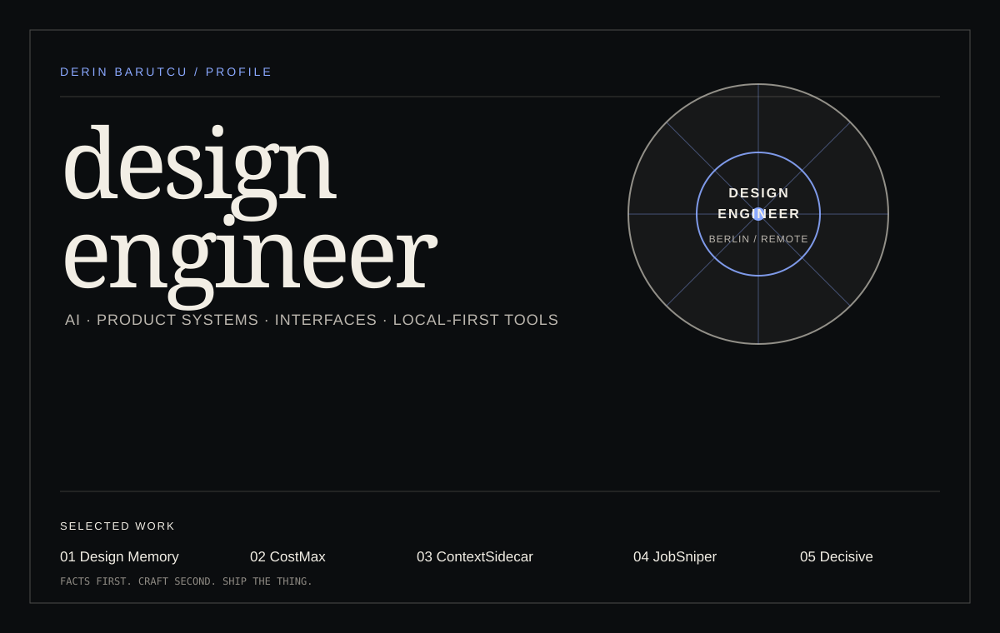
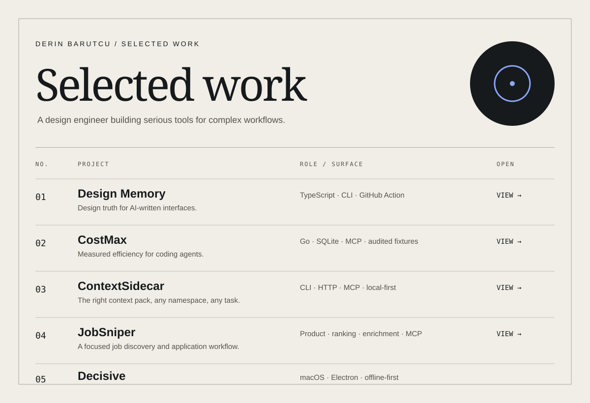

  

  <a href="https://derinb.vercel.app/">Portfolio</a>
  ·
  <a href="https://x.com/derinbarutcu_">X</a>
  ·
  <a href="#selected-work">Selected work</a>

I’m a design engineer in Berlin building interfaces, product systems, and local-first tools for AI and developer workflows.

## Selected work

  

### Project notes

| Project | What it is | Surface |
| --- | --- | --- |
| [Design Memory](https://github.com/derinbarutcu17/Design-Memory) | Deterministic checks that catch design-policy violations and reference mismatches in React/Tailwind changes. | TypeScript · CLI · GitHub Action |
| [CostMax](https://github.com/derinbarutcu17/costmaxx) | Local-first efficiency layer for coding agents; keeps full evidence while reducing model-visible output. | Go · SQLite · MCP |
| [ContextSidecar](https://github.com/derinbarutcu17/ContextSidecar) | A context layer for keeping the right project knowledge available across agent workflows. | CLI · HTTP · MCP |
| [JobSniper](https://github.com/derinbarutcu17/JobSniper) | A CV-based job discovery and application workflow built around ranking, enrichment, and automation. | Product · ranking · MCP |
| [Decisive](https://github.com/derinbarutcu17/decisive) | A local-first decision matrix for macOS, designed to make trade-offs visible and actionable. | macOS · Electron · offline-first |

How I work

 

I care about the seam between intent and implementation: the interaction model, the visual system, the content structure, and the code that makes the whole thing hold together.

The common thread across these projects is straightforward:

- make complex workflows legible;
- keep important work local and inspectable where possible;
- measure claims instead of decorating them;
- ship the interface and the system behind it.

## More work

[SynthKit](https://github.com/derinbarutcu17/SynthKit) · [Entule](https://github.com/derinbarutcu17/Entule) · [Berlin Venture Atlas](https://github.com/derinbarutcu17/venture-atlas) · [Signstream](https://github.com/derinbarutcu17/signstream) · [Vibe Library](https://github.com/derinbarutcu17/vibe-library)

 

  <a href="https://derinb.vercel.app/">derinb.vercel.app</a>
  ·
  <a href="https://x.com/derinbarutcu_">@derinbarutcu_</a>

